

    

<h1 align="center">The open-source notification infrastructure for developers</h1>

The ultimate service for managing multi-channel notifications with a single API.

<h3>Building a notification system for schools that delivers updates and 
reminders to students and parents</h3>

The "Notification Management System for School" is a project developed for the Connect Novu Hackathon. It offers an efficient solution for schools to manage notifications. The system includes an admin module for managing teachers, classes, and student data. Teachers can send posts to their assigned classes, while students and parents can access these posts through their respective modules. In-app and email notifications ensure timely updates. This system streamlines communication and improves engagement within the school community.

<h3>Technologies being used</h3>

Node.js Express.js MongoDB React.js

<h3>App Link</h3>

If there is

<h3>Screenshoot</h3>
Login Page:
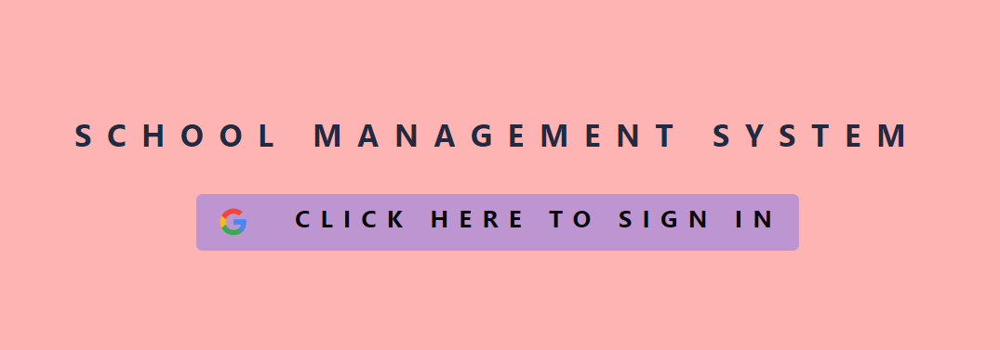
Admin Dashbord:
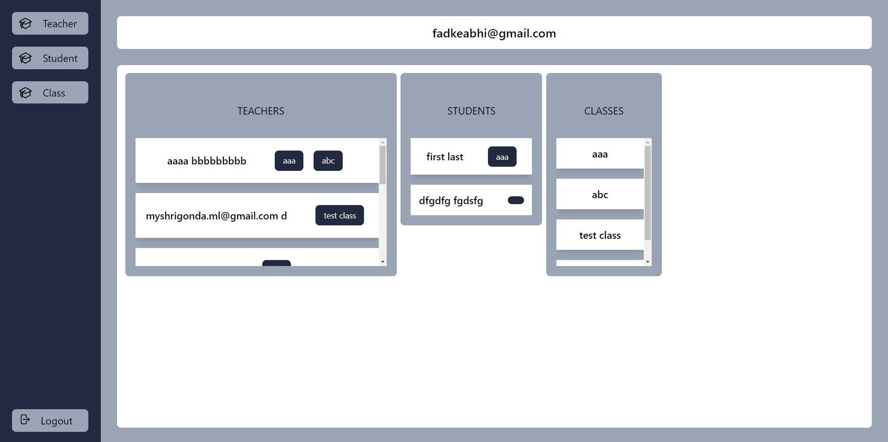
Admin Dashbord All Teachers List:
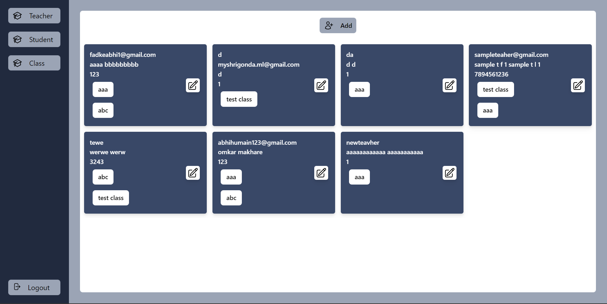
Admin Dashbord Create New Teacher:
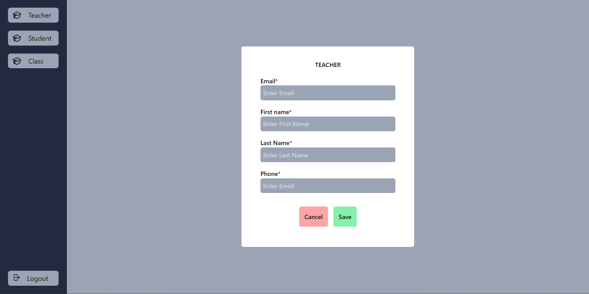
Admin Dashbord Update Teacher:
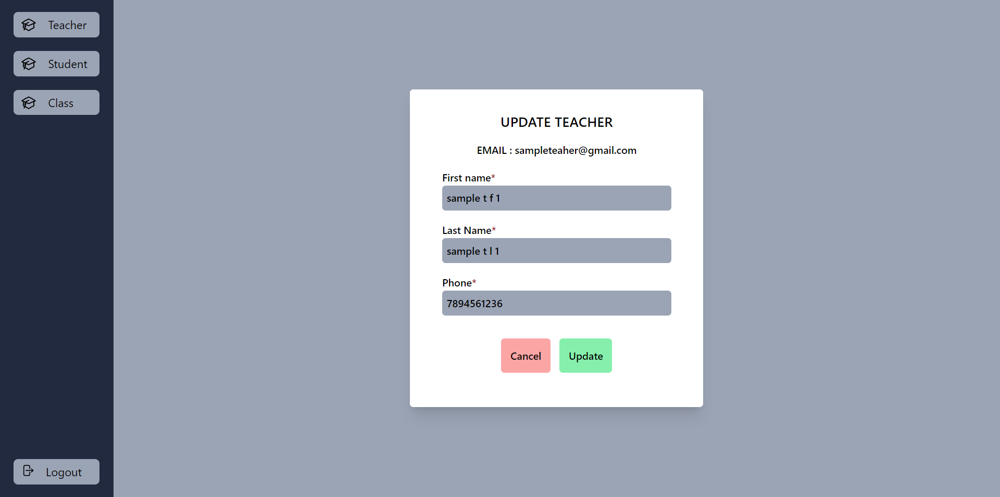
Admin Dashbord Update Class:
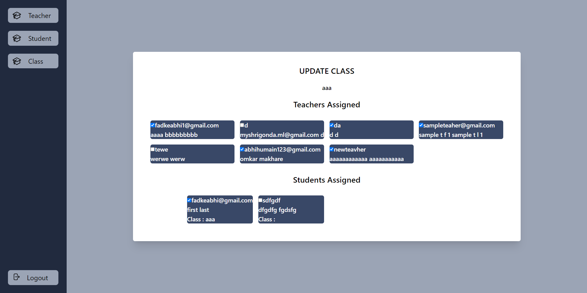
Admin Dashbord Update Student:
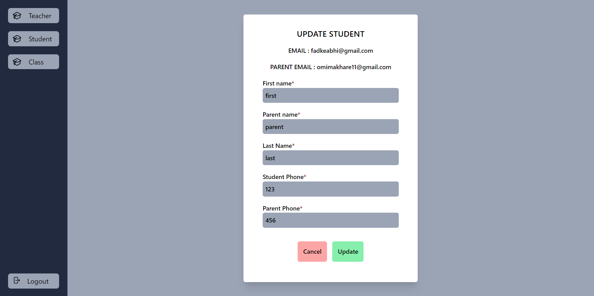
Teacher Dashboard:
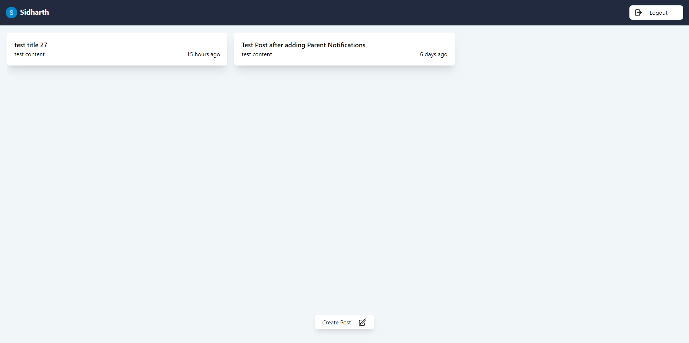
Teacher Dashboard Post Create:
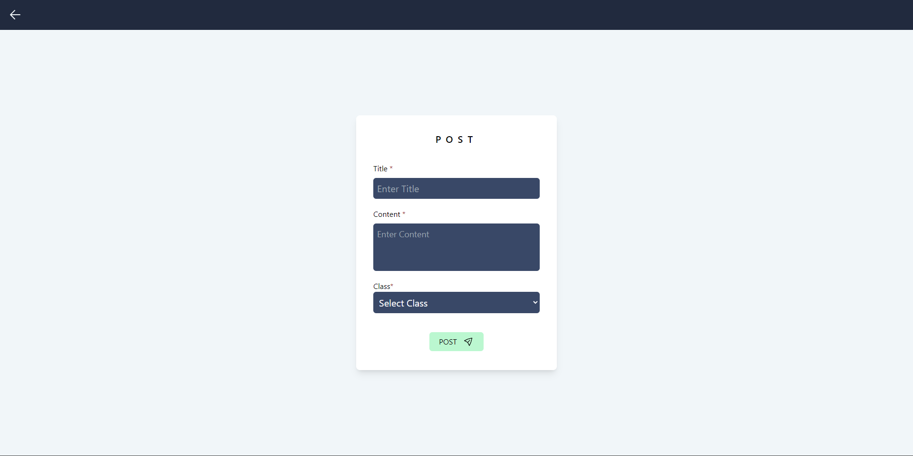
student Dashboard:
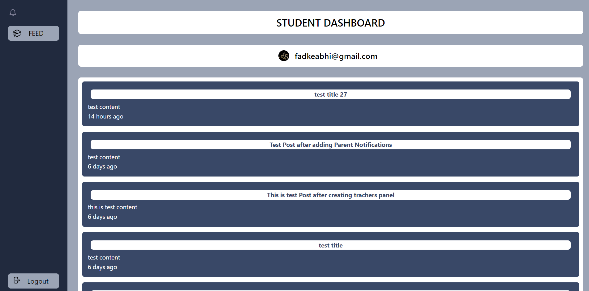
Student Dashboard In-App Notification:
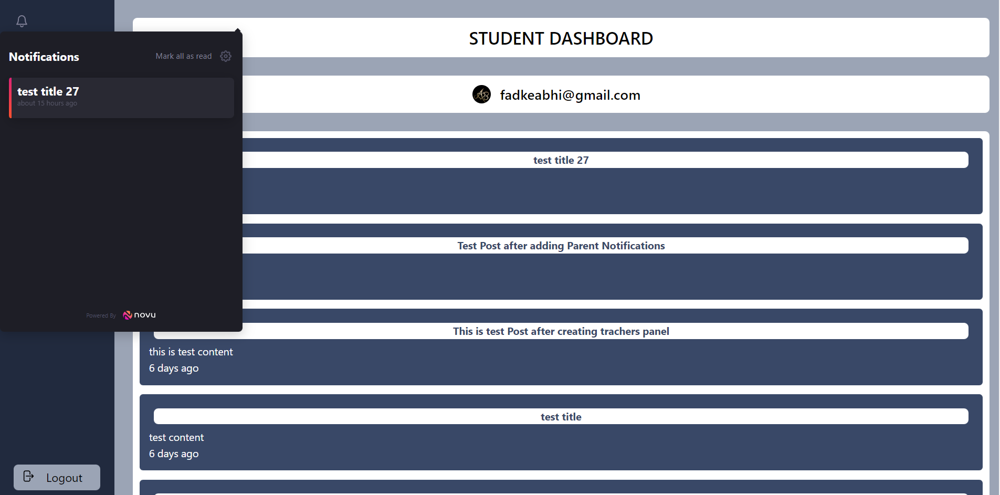

<h3>Description</h3>

The project we have built is the "Notification Management System for School". 

The system includes an admin module for managing teachers, classes, and student data. 

Teachers can send posts to their assigned classes, while students and parents can access these posts through their respective modules. 

It aims to In-app and email notifications ensure timely updates. This system streamlines communication and improves engagement within the school community. The system consists of several interconnected modules that work together to achieve its intended purpose.

<h3>Architecture</h3>

It is build using MERN stack and integrated the novu notification API for in-app and email notifications.

For authentication, we have used o-auth-google authentication and session. After getting the session the user gets redirected to its corresponding section.

We have created user-friendly interface to interact and feel attractive towards it.

<ul>
  <li>Admin 
    <ul>
      <li>In admin section, we can add and update the teachers, classes and students.</li>
    </ul>
  </li>
  <li>Teacher 
    <ul>
      <li>In Teacher section, teacher can add the post and it will generate the notification to students and parents.</li>
      <li>Teacher can create post for their respective class / classes only.</li>
    </ul>
  </li>
  <li>Student / Parent  
    <ul>
      <li>In this section, students or parents can see the latest post created in class they are assigned to.</li>
      <li>Also an In-App Notification from NOVU will be shown here.</li>
    </ul>
  </li>
</ul>

<h3>Who are you?</h3>

We are a dynamic duo pursuing our Bachelor's in Computer Engineering. With a shared passion for education and technology, we have developed the "Notification Management System for School" project. Our aim is to streamline communication between administrators, teachers, students, and parents through an intuitive platform. By leveraging our technical expertise and dedication, we strive to enhance the learning experience and promote collaboration within schools.

<h3>Conclusion</h3>

With its intuitive user interface, the School Management System ensures ease of use and accessibility for all users. It allows users to navigate through the system seamlessly, perform tasks efficiently, and retrieve information quickly. The system incorporates security measures to safeguard sensitive data, ensuring the privacy and confidentiality of student and staff information.

Through its well-structured architecture and feature-rich functionalities, the system offers a range of benefits for students, teachers, administrators, and parents.

